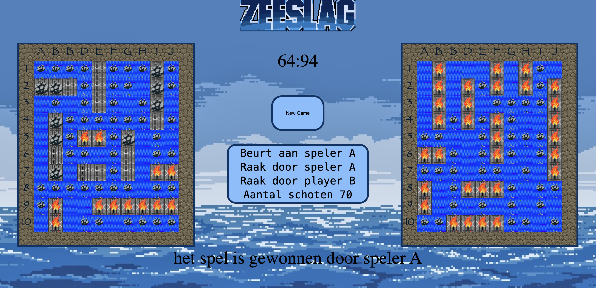

# Project JavaScript - Battleship Game

    

 
This project, part of KU Leuven's first-semester 2019 course, involves implementing the [Battleship game](<https://en.wikipedia.org/wiki/Battleship_(game)>) using JavaScript, HTML, and CSS.

 

    

